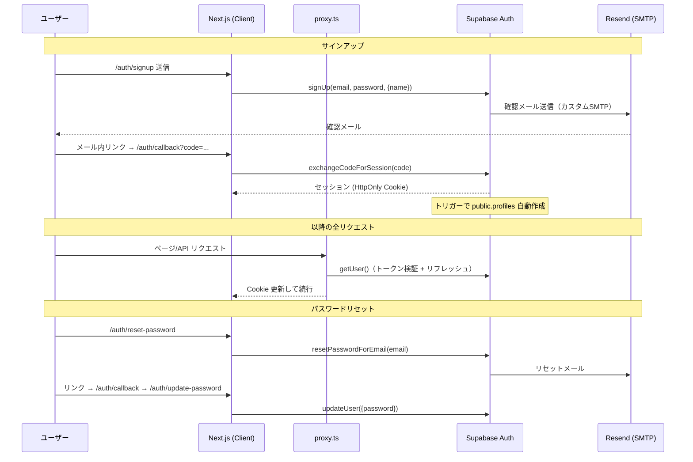

# haidozo リリースアーキテクチャ設計書

作成日: 2026-06-12 / 作成: アーキテクチャレビューセッション（Fable 5）

## 0. 確定事項（ユーザー回答）

| 項目 | 決定 |
|---|---|
| 認証 | Supabase Auth（Email/Password、HttpOnly Cookie セッション） |
| DB / ストレージ | Supabase All-in-One（PostgreSQL + Storage `gift-images`） |
| メール送信 | Resend（Supabase カスタム SMTP 連携） |
| 検索 | 初期: タグ + 全文検索（AIなし）→ 3〜6ヶ月後 Embedding 追加 |
| デプロイ | Vercel + Supabase |

## 1. 現状調査での重要発見（初期指示との差分）

1. **既存コードは screens 型 SPA**：`ClientShell.tsx` が state で画面切替し、データは `mockData.ts`。初期指示の `/app/src/app/feed/page.tsx` 等のルートは存在しない。→ 既存 screens を温存し、認証のみ実ルート追加、データ層を mock → Supabase に差し替える方針。
2. **Next.js 16 では `middleware.ts` → `proxy.ts` に改名**（`node_modules/next/dist/docs/01-app/01-getting-started/16-proxy.md`）。Supabase SSR の一般的なドキュメント（middleware.ts 前提）をそのまま使うと動かない。
3. **既存 `Post` 型は初期指示のスキーマより豊富**：`about / reason / reaction / persona[] / vibes[]` を持つ。DB スキーマは初期指示（productName, description）ではなく実際の型に合わせる。
4. **日本語全文検索に PostgreSQL `tsvector` は不適**（日本語の分かち書き不可）。`pg_trgm` (GIN) + タグ配列インデックスで実装。既存の `searchUtils.ts`（キーワード展開マップ）はクライアント側でクエリ展開に再利用。
5. `users` テーブルは作らない。Supabase 管理の `auth.users` + `public.profiles`（トリガーで自動作成）。

## 2. ディレクトリ構成（リリース版）

```
app/
├── proxy.ts                        # ★ セッションリフレッシュ（Next16: middleware の後継）
├── src/
│   ├── app/
│   │   ├── page.tsx                # 既存 ClientShell（認証後メイン）
│   │   ├── auth/
│   │   │   ├── login/page.tsx
│   │   │   ├── signup/page.tsx
│   │   │   ├── reset-password/page.tsx
│   │   │   ├── update-password/page.tsx
│   │   │   └── callback/route.ts   # メール確認・リセットリンクの code 交換
│   │   └── api/
│   │       ├── posts/route.ts          # GET(feed) / POST(作成)
│   │       ├── posts/[id]/route.ts     # GET / DELETE
│   │       ├── posts/[id]/like/route.ts# POST(トグル)
│   │       └── search/route.ts         # GET ?q=&relation=&scene=&price=
│   ├── components/                 # 既存（screens / ui / layout）温存
│   ├── lib/
│   │   ├── supabase/
│   │   │   ├── client.ts           # ブラウザ用 createBrowserClient
│   │   │   ├── server.ts           # サーバ用 createServerClient (cookies)
│   │   │   └── proxy.ts            # proxy.ts から呼ぶ updateSession
│   │   ├── api.ts                  # クライアント→API のフェッチラッパ + エラー整形
│   │   ├── validation.ts           # 入力検証（zod）
│   │   ├── embeddings.ts           # フェーズ2スケルトン（実装なし、interfaceのみ）
│   │   └── searchUtils.ts          # 既存（クエリ展開）
│   └── types/index.ts              # 既存 + DB Row 型
└── supabase/
    └── migrations/
        ├── 0001_init.sql           # profiles / posts / post_likes / searches + トリガー
        ├── 0002_rls.sql            # RLS ポリシー
        └── 0003_storage.sql        # gift-images バケット + ポリシー
```

## 3. 認証フロー



要点：

- `@supabase/ssr` を使用。`getSession()` でなく **`getUser()` で検証**（Cookie 偽装対策）。
- proxy.ts はオプティミスティックチェックのみ（Next 公式の推奨どおり、認可の最終防衛線は RLS + API 側検証）。
- JWT exp / refresh は Supabase 管理（手動 JWT 実装はしない。初期指示の `/app/lib/auth.ts` 自前 JWT は廃案）。

## 4. DB スキーマ

```mermaid
erDiagram
    auth_users ||--|| profiles : "trigger で自動作成"
    profiles ||--o{ posts : "user_id"
    profiles ||--o{ post_likes : "user_id"
    profiles ||--o{ searches : "user_id"
    posts ||--o{ post_likes : "post_id"

    profiles {
        uuid id PK "= auth.users.id"
        text name
        text avatar_url
        timestamptz created_at
    }
    posts {
        uuid id PK
        uuid user_id FK
        text item "贈ったもの"
        text relation "恋人/友達/家族/上司/同僚/先生・恩師"
        text scene "誕生日/記念日/お礼/..."
        text price "〜3,000円/〜5,000円/〜10,000円/それ以上"
        text about "贈った相手のこと"
        text reason "なぜ選んだか（必須）"
        text reaction "贈った時のこと（任意）"
        text_array persona "どんな人タグ"
        text_array vibes "共感タグ"
        text image_url
        text url
        timestamptz created_at
    }
    post_likes {
        uuid post_id PK_FK
        uuid user_id PK_FK
        timestamptz created_at
    }
    searches {
        uuid id PK
        uuid user_id FK
        text query
        timestamptz created_at
    }
```



制約・インデックス：

- `relation / scene / price` は CHECK 制約（`src/types/index.ts` のユニオン型と一致させる）
- B-tree: `posts(relation)`, `posts(scene)`, `posts(price)`, `posts(created_at desc)`
- GIN: `posts using gin ((item || ' ' || about || ' ' || reason || ' ' || coalesce(reaction,'')) gin_trgm_ops)`（pg_trgm、日本語部分一致）
- GIN: `posts(persona)`, `posts(vibes)`（配列タグ検索）
- likes 数は `post_likes` の count（非正規化カウンタはリリース後に検討）

## 5. RLS ポリシー設計

| テーブル | SELECT | INSERT | UPDATE | DELETE |
|---|---|---|---|---|
| profiles | 全員可 | 本人のみ (`id = auth.uid()`) | 本人のみ | 不可 |
| posts | 全員可（公開フィード） | 本人のみ (`user_id = auth.uid()`) | 本人のみ | 本人のみ |
| post_likes | 全員可 | 本人のみ | 不可 | 本人のみ |
| searches | 本人のみ | 本人のみ | 不可 | 本人のみ |
| Storage `gift-images` | 公開読取 | 認証済 & 自フォルダ (`{uid}/...`) のみ | 不可 | 本人のみ |

- 全テーブル `enable row level security` 必須。service_role キーはサーバのみ・原則不使用（RLS バイパスを避ける）。
- 投稿画像はアップロード前にクライアントで EXIF 除去 + リサイズ（プライバシー / 帯域）。

## 6. API 設計（標準レスポンス）

```
成功: { data: T }
失敗: { error: { code: string, message: string } }  // message は日本語
400 入力不正 / 401 未認証 / 403 権限なし / 404 対象なし / 500 サーバエラー
```

- 入力検証は zod。SQL は Supabase クライアント経由のみ（生 SQL 文字列結合禁止 → SQLi 対策）。
- 検索: `GET /api/search?q=...&relation=...&scene=...&price=...` → trgm `ilike`/`%` + タグ overlap、`searches` に記録。
- レート制御はリリース後（Vercel + Supabase 標準の保護で初期は許容）。

## 7. 環境変数

| 変数 | 置き場所 |
|---|---|
| `NEXT_PUBLIC_SUPABASE_URL` | .env.local / Vercel |
| `NEXT_PUBLIC_SUPABASE_ANON_KEY` | .env.local / Vercel（RLS 前提で公開可） |
| `SUPABASE_SERVICE_ROLE_KEY` | Vercel Secrets（原則不使用、絶対にクライアント禁止） |
| Resend SMTP | Supabase Dashboard 側設定（コードに含めない） |

## 8. フェーズ2（Embedding）への布石

- `lib/embeddings.ts` は interface（`embedPost`, `searchSimilar`）+ TODO のみ。
- マイグレーションに `create extension if not exists vector;` はまだ入れない（0004 で追加予定）。
- `searches` テーブルがクエリログとして Embedding 学習の素材になる。

## 9. リリース前チェックリスト

- [ ] 登録 → メール確認 → ログイン → 投稿作成 → フィード表示 E2E
- [ ] パスワードリセットフロー（Resend 経由メール到達）
- [ ] 未認証で POST /api/posts・DELETE /api/posts/:id が 401
- [ ] 他人の投稿 DELETE が 403/404（RLS 検証）
- [ ] 検索（キーワード・タグ・複合）動作
- [ ] 375px 表示崩れなし
- [ ] エラーメッセージ日本語化（400/401/403/404/500）
- [ ] Lighthouse ≥ 80（モバイル）
- [ ] `.env` が git 管理外 / Vercel 環境変数設定済み
- [ ] Vercel ステージングでのデプロイ確認
